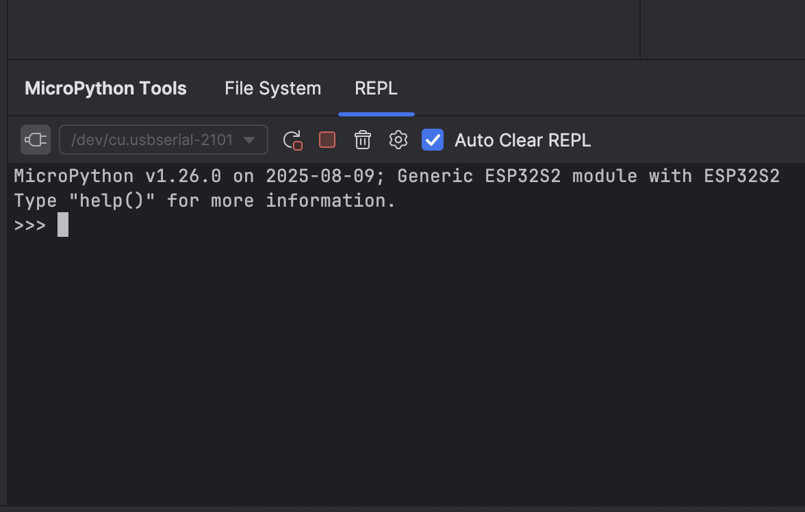

# MicroPython Tools for PyCharm, CLion and other JetBrains IDEs

This is a fork of the [JetBrains IntelliJ MicroPython plugin](https://github.com/JetBrains/intellij-micropython).
Credits to [Andrey Vlasovskikh](https://github.com/vlasovskikh) for creating the original plugin and
to [Ilia Motornyi](https://github.com/elmot) for rewriting the communication layer to kotlin and for developing the file
system view, which serves as the foundation for this project.

Many thanks also go to [Jos Verlinde](https://github.com/Josverl/micropython-stubs) for creating and maintaining the
MicroPython stubs
that this plugin uses.

I have decided fork the original jetbrains plugin as its development had slowed and I wanted to focus on implementing
more advanced features that I deem invaluable based on my professional experience working with MicroPython

I believe that the MicroPython community needs robust, actively maintained and developed tools adding MicroPython
support to modern industry-standard IDEs. My aim with this fork is to address this need.

There will be frequent updates, I'm actively working on developing new features and fixing bugs in the existing
code. If you run into any problems while using this plugin, please create an issue. For any suggestions or feature
requests, feel free to start a discussion.

Some of the features you can expect soon include:

- Built-in MicroPython firmware flashing support
- Integration with mpy-cross to allow compiling to bytecode

Long term plans:

- After the full-release of this plugin I might consider also developing MicroPython plugins for VSCode
  and possibly Visual Studio 2022

## Quick start

To access all of the features this plugin offers I recommend always creating a Project upload configuration in every
project.

After enabling MicroPython support in the "Languages & Frameworks" section of settings you will be able to mark
directories as MicroPython Sources Roots. The upload project run configuration uploads contents of the top most
MicroPython Sources Roots marked folders. So you can treat these folders as the root "/" of the device's MicroPython
file system when structuring your project.

I also recommend enabling the synchronize run configuration option, that way you don't have to worry about cleaning up
the File System
if you make large changes to your project. When running the upload run configuration, all folders and files that were
not apart of the
upload will be deleted - you can also simply configure excluded target (MicroPython) paths, that will be
ignored by the synchronization feature.

For projects which involve uploading large files *(For MicoPython standards)*, FTP uploads might help speed things up,
especially if you're using serial communication.

Finally, don't forget to select the appropriate stubs package for your device. You can do so in the plugin's settings.
Start typing "micropython" in the "Stubs package" text field and you can browse all available packages via autocomplete.

## Features

### File System widget

- Easily view and interact with the MicroPython device file system
- Upload to or reorganize the file system via drag and drop
  

### REPL Widget

- Observe code execution via REPL
  

### Run Configurations

- #### Upload
    - Comfortably select what gets uploaded
    - Synchronize device file system to only contain uploaded files and folders
    - Exclude on-device paths from synchronization
      
- #### Execute in REPL
    - Execute selected ".py", ".mpy" file or code in REPL without uploading it to the device
      

### Context Menu Actions

- Quickly upload or execute selected files
  
- Custom "Mark as MicroPython Sources Root" action that allows compatibility many different JetBrains IDEs
  

### Settings

#### FTP Uploads

- Speed up large or unstable serial communication uploads via built-in FTP support
- Just enter the wi-fi credentials of the network your computer is connected to. The plugin will automatically handle
  starting the FTP server and establishing a connection over serial communication

#### MicroPython Stubs

- Built-in stubs management Integrates all available MicroPython stubs packages
  by [Jos Verlinde](https://github.com/Josverl/micropython-stubs)

### Other

- Automatically skips already uploaded files (on boards with the required crc32 binascii capabilities)

## Requirements

* A valid Python interpreter 3.10+
* Python Community plugin (For non-PyCharm IDEs)
* A development board with MicroPython installed (1.20+ is recommended)

The plugin is licensed under the terms of the Apache 2 license.
